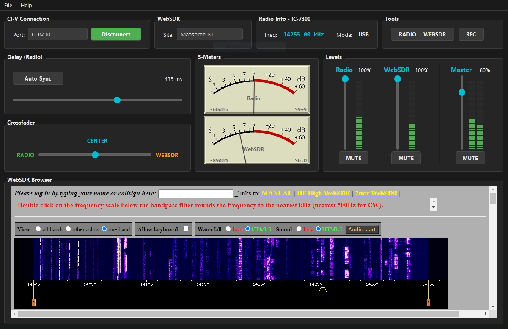

# HamMixer CT7BAC

### Professional Dual-Source Audio Mixer for Ham Radio Operators

**Synchronize your local transceiver with remote WebSDR receivers for enhanced DX monitoring**

---

## Overview

HamMixer is a specialized Windows desktop application designed for ham radio operators who want to **simultaneously monitor their local transceiver and remote WebSDR receivers**. It provides real-time audio mixing, automatic frequency synchronization via CAT protocols, and professional-grade DSP processing.

**Multi-brand radio support**: Icom (CI-V), Kenwood, Elecraft, and newer Yaesu radios are all supported with **automatic protocol detection** - just click Connect and HamMixer identifies your radio.

Whether you're chasing DX, monitoring propagation, or comparing reception between your station and remote SDRs around the world, HamMixer gives you the tools to do it seamlessly.

<p align="center">
  
</p>

---

## Key Features

### Audio Mixing & Processing
- **Dual-channel mixer** with independent volume, pan, and mute controls
- **Real-time crossfader** for smooth transitions between radio and WebSDR audio
- **Low-latency WASAPI audio engine** (~21ms buffer cycles)
- **Soft-clipping limiter** to prevent audio distortion
- **WAV recording** of mixed output with automatic file naming

### Multi-Brand Radio Integration
- **Automatic protocol detection** - Click Connect and HamMixer identifies your radio
- **Icom model detection** - Automatically detects and displays your Icom radio model (IC-7300, IC-705, IC-7610, etc.)
- **Automatic frequency sync** - WebSDR follows your VFO in real-time
- **Mode synchronization** - USB, LSB, CW, AM, FM modes automatically matched
- **Dual S-Meter display** - Compare signal strength between local and remote
- **Supported protocols**: Icom CI-V (binary) and Kenwood/Elecraft CAT (ASCII)

### WebSDR Control
- **Multiple WebSDR sites** - Switch between receivers worldwide
- **Automatic band selection** - WebSDR changes bands with your radio
- **Embedded browser** - WebSDR page displayed within the main application
- **S-Meter extraction** - Real-time signal level from WebSDR

### Time Synchronization
- **GCC-PHAT algorithm** - Professional-grade delay detection
- **Auto-sync button** - Automatically align audio streams (2-second capture)
- **Manual delay control** - 0-700ms adjustable delay
- **Compensates for internet latency** between local and remote audio

---

## Supported Radios

HamMixer supports radios from multiple manufacturers with **automatic protocol detection**. Simply connect your radio and click Connect - the software will identify the correct protocol automatically.

| Brand | Protocol | Supported Models |
|-------|----------|------------------|
| **Icom** | CI-V (Binary) | IC-705, IC-7100, IC-7300, IC-7610, IC-7851, IC-9700, and other CI-V compatible models. **Model auto-detected and displayed.** |
| **Kenwood** | CAT (ASCII) | TS-480, TS-590, TS-590S, TS-590SG, TS-890S, TS-990S, TS-2000, and other CAT-compatible models |
| **Elecraft** | CAT (ASCII) | K2, K3, K3S, K4, KX2, KX3 |
| **Yaesu** | CAT (ASCII) | FT-991, FT-991A, FT-710, FTDX10, FTDX101D, FTDX101MP (newer models with Kenwood-like CAT) |

### Protocol Detection Order
When you click Connect, HamMixer tries:
1. **Icom CI-V** at 57600 baud, then 115200 baud
2. **Kenwood/Elecraft/Yaesu CAT** at 38400, 9600, then 4800 baud

Detection takes 1-2 seconds. A successful connection shows the frequency display updating in real-time.

> **Note:** Older Yaesu radios using the legacy 5-byte CAT protocol (FT-450, FT-817, FT-857, FT-897, etc.) are not currently supported.

---

## User Interface Layout

<p align="center">
  
</p>

### Top Row Sections (Left to Right)
- **Radio Connection (30%)**: COM port selection and Connect/Disconnect button (auto-detects protocol)
- **WebSDR (20%)**: Site selector dropdown
- **Radio Info (25%)**: Current frequency and mode display; shows detected Icom model (e.g., "Radio Info - IC-7300")
- **Tools (25%)**: BOTH/RADIO/WEBSDR toggle and REC button with indicator

### Controls Row
- **Delay/Crossfader**: Time sync controls and audio balance
- **S-Meters**: Stacked vertically - Radio on top, WebSDR below
- **Levels**: Channel strips with volume sliders, LED meters, and mute buttons

### Audio Device Configuration
Audio devices are configured via **File > Audio Devices...** menu, keeping the main window clean and focused.

---

## System Architecture

<p align="center">
  
</p>

---

## Signal Flow

<p align="center">
  
</p>

---

## Requirements

### Hardware
- **Amateur radio transceiver** with CAT control (see [Supported Radios](#supported-radios))
- **USB Audio Interface** or radio's built-in USB audio
- **Windows PC** with decent CPU for browser rendering

### Software
- **Windows 10/11** (64-bit)
- **Visual C++ Redistributable 2022** ([Download](https://aka.ms/vs/17/release/vc_redist.x64.exe))

### Recommended Audio Setup
For best results, use **VB-Cable** (virtual audio cable) to route WebSDR audio:
1. Set browser audio output to VB-Cable
2. Select VB-Cable as WebSDR input in HamMixer

---

## Installation

### Pre-built Release
1. Download the latest release from [Releases](https://github.com/pedro-setera/ham-mixer/releases)
2. Extract to your desired location (e.g., `C:\HamMixer`)
3. Run `HamMixer.exe`

### Build from Source

**Prerequisites:**
- Qt 6.7+ with WebEngine component
- CMake 3.21+
- Visual Studio 2019/2022 or MinGW-w64

**Build steps:**
```batch
cd HamMixerCpp
mkdir build && cd build
cmake -G "Visual Studio 17 2022" -A x64 -DCMAKE_PREFIX_PATH="C:\Qt\6.8.0\msvc2022_64" ..
cmake --build . --config Release
```

Or use the provided build script:
```batch
cd HamMixerCpp
build.bat
```

---

## Quick Start Guide

### 1. Connect Your Radio
- Connect your radio via USB (provides both CAT control and audio)
- Supported: Icom, Kenwood, Elecraft, and newer Yaesu radios
- See [Supported Radios](#supported-radios) for full compatibility list

### 2. Configure Audio Devices
- Open **File > Audio Devices...** to configure audio routing
- **Radio Input**: Select your radio's USB audio device
- **WebSDR Input**: Select VB-Cable or system audio capture
- **Output**: Select your speakers/headphones

### 3. Connect to Radio
- Select the COM port for your radio
- Click **Connect** - HamMixer auto-detects your radio's protocol
- For Icom radios, the model name will appear in the title (e.g., "Radio Info - IC-7300")
- Frequency display should show your VFO within 1-2 seconds
- WebSDR page will load automatically in the embedded browser

### 4. Select WebSDR Site
- Choose a WebSDR from the dropdown (or add custom sites via File menu)
- The WebSDR will automatically tune to your radio's frequency

### 5. Adjust Mix
- Use **channel sliders** for individual volume control
- Use **crossfader** to blend between radio and WebSDR
- Use **BOTH/RADIO/WEBSDR** toggle for quick switching

### 6. Synchronize Audio
- Click **Auto-Sync** to automatically detect and compensate for delay
- Or manually adjust the delay slider until audio aligns

---

## Audio Parameters

| Parameter | Value | Notes |
|-----------|-------|-------|
| Sample Rate | 48,000 Hz | Fixed (IC-7300 native rate) |
| Bit Depth | 16-bit signed | Standard PCM |
| Channels | Stereo | Dual mono mixed to stereo |
| Buffer Size | 1024 samples | ~21ms latency |
| Delay Range | 0-700ms | Compensates internet latency |

---

## Supported WebSDR Sites

HamMixer works with standard WebSDR 2.x sites. Pre-configured sites include:
- **Maasbree, Netherlands** - Excellent HF coverage
- **Utah, USA** - 160m-40m bands
- **Twente, Netherlands** - Wide frequency coverage
- And many more...

You can add custom WebSDR sites through **File > Manage WebSDR...** menu.

---

## Troubleshooting

### No audio from radio
- Check Windows sound settings - ensure radio USB audio is not muted
- Verify correct input device selected in HamMixer

### WebSDR not following frequency
- Ensure radio is connected (green indicator)
- Check that WebSDR site supports the current band
- Some WebSDRs have limited band coverage

### Radio not detected
- Ensure radio is powered on and connected via USB
- Check that correct COM port is selected
- Verify radio's CAT/CI-V settings match expected baud rates
- Icom: 57600 or 115200 baud recommended
- Kenwood/Elecraft/Yaesu: 38400, 9600, or 4800 baud

### Audio out of sync
- Click **Auto-Sync** button during voice transmission
- Manually adjust delay slider if auto-sync fails
- Typical internet delay is 200-400ms

### High CPU usage
- WebSDR browser rendering can be CPU-intensive
- Close unnecessary browser tabs/applications

---

## Contributing

Contributions are welcome! Please feel free to submit issues or pull requests.

### Development Setup
1. Fork the repository
2. Clone your fork
3. Install Qt 6.7+ with WebEngine
4. Build using CMake
5. Submit PR with your changes

---

## Contact

**Developed by CT7BAC**

For questions, suggestions, or collaboration inquiries, please look up my contact information on [QRZ.com](https://www.qrz.com) using callsign **CT7BAC**.

---

## License

This project is provided as-is for the amateur radio community. See [LICENSE](LICENSE) file for details.

---

## Acknowledgments

- **PA3FWM** - Creator of WebSDR
- **Icom** - For the CI-V protocol documentation
- **Kenwood** - For the CAT protocol documentation
- **Elecraft** - For K-series programmer's reference
- **Qt Project** - For the powerful cross-platform framework
- **Amateur Radio Community** - For inspiration and testing

---

<p align="center">
  
</p>

<p align="center">
  <i>73 de CT7BAC</i>
</p>
